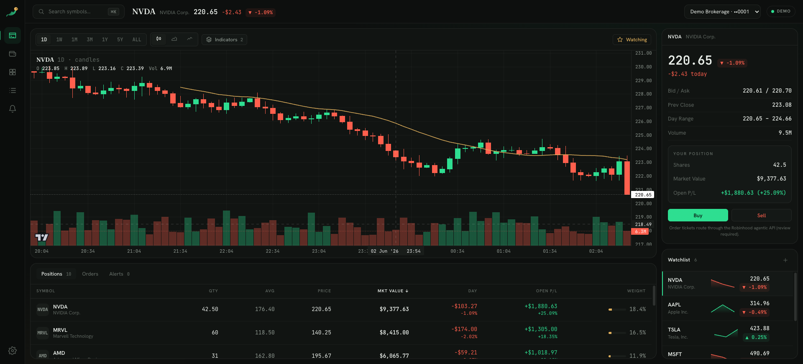
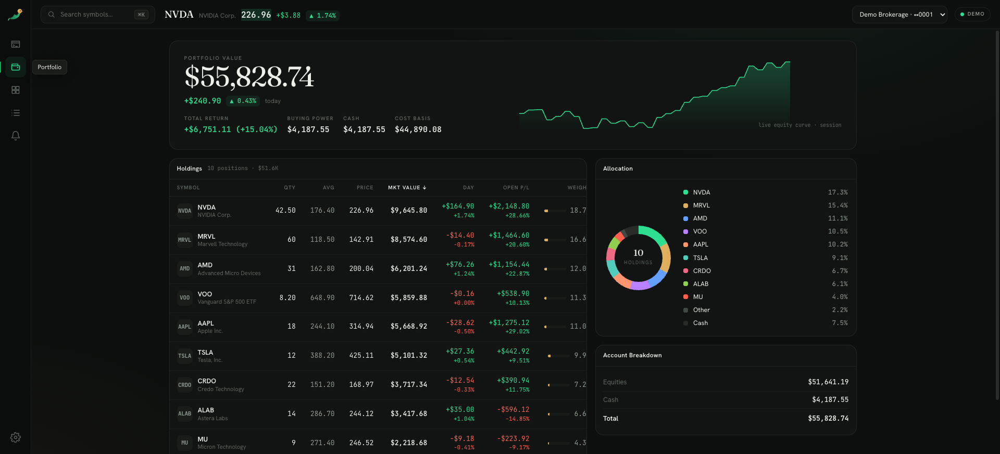
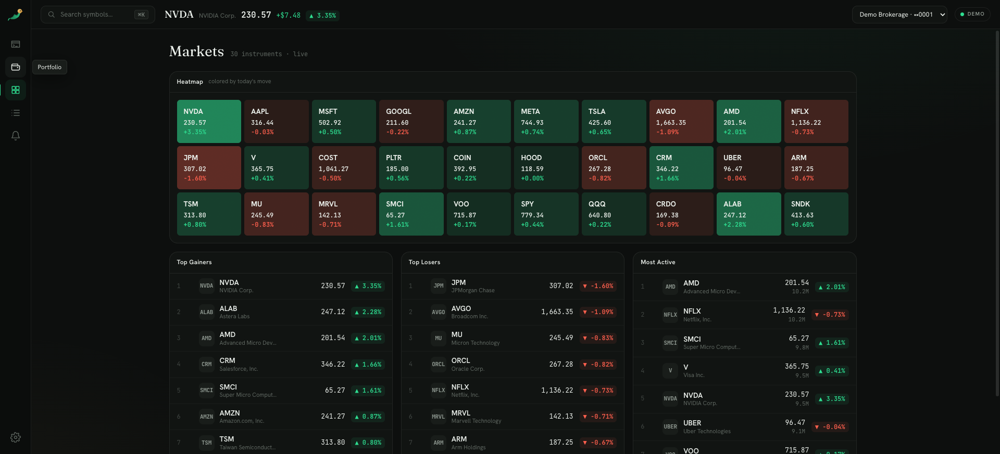

<div align="center">


### A TradingView-class terminal for your Robinhood portfolio

Live charts · technical indicators · real-time P&L · watchlists · price alerts

<sub>Built on the Robinhood MCP trading server · React + lightweight-charts · MIT licensed</sub>

</div>

<br/>



<br/>

## What is RobinView?

**RobinView** turns your Robinhood account into a professional trading terminal. It reads
live positions, quotes, and portfolio value through the official **Robinhood MCP trading
server** and renders them in a fast, keyboard-driven interface modeled on the tools serious
traders actually use — candlestick charts with studies, a live heatmap, sortable holdings,
and crossing alerts.

It runs **out of the box in demo mode** (a deterministic market simulator — no account, no
auth, instantly live) and switches to your real account by adding one token.

> [!IMPORTANT]
> RobinView is an independent project and is **not affiliated with or endorsed by
> Robinhood**. It is a portfolio **viewer and analysis tool** — not investment advice.
> See [Data & honesty](#data--honesty) for exactly what is real vs. reconstructed.

## Features

**Charting**
- Candlestick / area / line charts powered by [`lightweight-charts`](https://github.com/tradingview/lightweight-charts) (TradingView's own open-source engine)
- 7 timeframes (1D → ALL), volume histogram, crosshair OHLC readout
- Overlays: **SMA 20/50, EMA 21, Bollinger Bands, VWAP**
- Synced oscillator pane: **RSI (14)** and **MACD (12/26/9)**
- Live last-price streamed into the forming candle

**Portfolio**
- Editorial hero with total value, day change, total return, buying power, cost basis
- Live equity curve, sortable holdings table with per-position day & open P&L, weight bars
- Allocation donut by holding + account breakdown (equities / options / crypto / cash)

**Markets**
- Live heatmap colored by daily move · Top Gainers / Losers / Most Active

**Workflow**
- ⌘K command palette — fuzzy symbol & company search + navigation
- Watchlists (persisted), price alerts with browser notifications on crossing
- Multi-account switching (margin / cash / IRA)

<table>
<tr>
<td width="50%"><p align="center"><sub>Portfolio</sub></p></td>
<td width="50%"><p align="center"><sub>Markets heatmap</sub></p></td>
</tr>
</table>

## Quick start

```bash
git clone https://github.com/<you>/robinview.git
cd robinview
npm install
npm run dev
```

Open **http://localhost:5273**. That's it — demo mode streams a live simulated market
immediately, so you can explore every feature with no account.

## Going live with your Robinhood account

RobinView talks to the Robinhood **MCP trading server** at `https://agent.robinhood.com/mcp/trading`.
The endpoint is OAuth-gated, so you supply a bearer token from your Robinhood agent session:

```bash
cp .env.example .env
# edit .env:
#   ROBINVIEW_MODE=live
#   ROBINHOOD_MCP_TOKEN=<your robinhood agent token>
npm run dev
```

The top-bar badge flips from **Demo** to **Live** and your real accounts, positions, and
portfolio value load. No token? RobinView stays in demo mode — it never blocks on auth.

## Production

```bash
npm run build      # bundles the frontend into dist/
npm start          # single Node process serves API + WebSocket + static app on :8787
```

## Architecture

```
                ┌──────────────────────── browser ────────────────────────┐
                │  React + lightweight-charts · Zustand store · WS client  │
                └───────────────┬───────────────────────┬──────────────────┘
                       REST /api │                       │ /ws  (live quotes,
                                 ▼                       ▼       portfolio, positions)
                ┌──────────────────────── server (Node) ───────────────────┐
                │  Express + ws  ·  tick loop broadcasts to subscribers     │
                │                    DataProvider (one interface)           │
                │        ┌────────────────────┴────────────────────┐        │
                │   MockProvider (GBM sim)              MCPProvider (live)   │
                └────────────────────────────────────────┬─────────────────┘
                                                          ▼
                                          Robinhood MCP trading server
```

A single `DataProvider` interface (`server/provider/types.ts`) backs both modes, so the UI
is identical whether data is simulated or real. The server fans live updates out over one
WebSocket, fetching each upstream symbol only once per tick regardless of how many panels
subscribe.

- **`shared/types.ts`** — normalized domain model (the wire format sends decimals as strings; everything downstream is numbers)
- **`src/lib/indicators.ts`** — pure, tested SMA/EMA/RSI/MACD/Bollinger/VWAP math
- **`server/provider/`** — providers, the deterministic market engine, and the demo universe

## Data & honesty

RobinView is precise about what is real:

| Data | Demo mode | Live mode |
|------|-----------|-----------|
| Quotes, positions, portfolio, orders | Simulated (deterministic) | **Real**, from Robinhood MCP |
| Live price motion | Simulated tick engine | **Real** quote polling |
| Historical OHLC candles | Generated | **Reconstructed** — see below |

The Robinhood MCP surface does not expose historical OHLC, so chart history is reconstructed
by a deterministic, per-symbol random walk **anchored to the real live price and previous
close**. Intraday motion layered on top is the real quote stream. This is disclosed in the
chart and here so nobody mistakes the reconstructed history for settled exchange data.

## Tech

React 18 · TypeScript · Vite · lightweight-charts · Zustand · Express · ws ·
`@modelcontextprotocol/sdk` · Fraunces / Hanken Grotesk / JetBrains Mono

```bash
npm run typecheck   # strict TS, no errors
npm test            # indicator math unit tests
```

## License

MIT — see [LICENSE](./LICENSE). Not affiliated with Robinhood Markets, Inc. or TradingView.
Use at your own risk; nothing here is financial advice.
